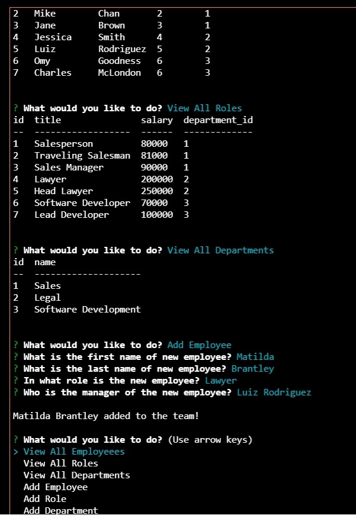

# Employee Tracker

### [My GitHub](https://github.com/matildabrantley)
## Table of Contents:
* [Installing](#installing)
* [Usage](#usage)
* [Features](#features)
* [Screenshot](#screenshot)
* [Video](#video)
* [License](#license)
* [Questions](#questions)
## Description
Create and update a MySQL database for a company's employees through a command line application using Inquirer.js
## Usage
 Use cases include any company needing to view, add and update each of their employees' data, including their personal information, roles, salaries for each role, managers for each employee, roles per a department and more.
## Installing 
* The following command installs dependencies:
  * npm i
## Features
* View functions:
    * viewAllEmployees()
    * viewAllRoles()
    * viewAllDepartments()
* Add functions:
    * addEmployee()
        * Includes menu for picking roles queried from database.
    * addRole()
        * Includes menu for picking departments queried from database.
    * addDepartment()
* Inquirer.js for command-line prompting
* Console.table module for improved table formatting
* MySQL database maintained with query calls
    * seed.sql creates the database, creates 3 tables (Employees, Roles, Departments) and fills in example employees for each of the 7 roles and 3 departments.

# Screenshot

# Video
[Video Tutorial](https://drive.google.com/file/d/1CXygjcKbOd7Sqzvj1oni2NBsKFhdBQXf/view)
## License
The project is licensed under the MIT License license.
## Questions
Questions about the project may be directed to my email at matildahbrantley@gmail.com.
Here is a link to [my GitHub](https://github.com/matildabrantley) 
for access my other work.
